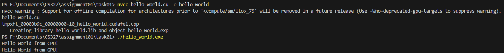

# **Assignment 01 Task 01** 

### System details
- OS : Windows 11 25H2
- GPU : RTX 3070
- Driver Version : 591.74
- CUDA Toolkit Version : 12.9


### Installation Steps
1. Download and install the latest driver for your nvidia device.
2. Download an install the latest CUDA toolkit from [NVIDIA CUDA Toolkit](https://developer.nvidia.com/cuda-downloads). Latest usually works fine since it has backwards compatibility (I'm using 12.9 because I already had it from before).
3.  Add CUDA to PATH if the installer didn't (`bin` directory to be specific).
4. Run ```nvcc --version ``` in the shell to verify installation.
5. To compile a .cu file simple run ```nvcc file.cu -o file``` in the shell.
---

```hello_world.cu```
Simple hello world program that prints hello world once from host and once from device.

